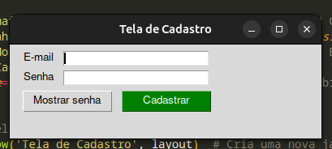

# Cadastro de usuário (interface com PySimpleGUI)

Este é um programa simples em Python que utiliza a biblioteca PySimpleGUI para criar uma interface gráfica de cadastro de usuários. Ele permite que o usuário insira um e-mail e senha, valide os dados e cadastre-os em um dicionário.

## Funcionalidades

- Campo de entrada para o e-mail do usuário.
- Campo de entrada para a senha do usuário.
- Validação do formato do e-mail utilizando a biblioteca email_validator.
- Verificação de e-mails já cadastrados.
- Exibição/ocultação da senha através de um botão.
- Mensagens de erro em caso de campos vazios ou formato inválido de e-mail.

## Tecnologias utilizadas

- Python: Linguagem de programação utilizada para escrever o código.
- PySimpleGUI: Biblioteca Python que fornece uma interface gráfica simples e intuitiva.
- email_validator: Biblioteca Python para validar o formato de endereços de e-mail.

## Como executar

1. Certifique-se de ter o Python instalado em sua máquina.
2. Instale as bibliotecas necessárias executando o comando `pip install PySimpleGUI email_validator`.
3. Execute o arquivo `cadastro.py` em seu ambiente Python.
4. A interface gráfica será exibida, permitindo que você insira e-mails e senhas para cadastro.
